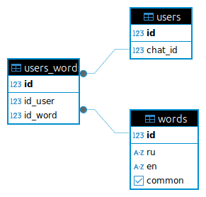

### Бот, для изучения английского в виде викторины.
В репозитории присутствует схема БД bot.png, settings.py с токеном бота и DSN для подключения к БД, models с моделями БД, crud.py для работы в БД и некоторые функции для бота, data.json для заполнение БД словами, и сам бот leart_bot.py. На всякий случай положил requirements, но там есть лишние библиотеки.

###    ВАЖНО!!
    Перед первым запуском learn_bot.py надо прописать DSN в settings.py и запустить файл crud.py  для сздания таблиц и заполнения начальными данными.

Что бот умеет:

Отправляет слова на русском и предлагает выбрать перевод этого слова с английского, из 4 случайных вариантов.
Если ответ не верный, выводится соответствующее сообщение, и предлагается повторно выбрать правильный
ответ. Если ответ верный - выводится соответствующее сообщение, предлагается перевести следующее слово.
Пользователь может добавлять и удалять свои слова. В случае, если у пользователя есть свои слова, они также могут 
предлагаться к переводу. Также пользователь может пропустить слово, если если не может его угадать.

Логика работы:

    Новый пользователь вводить команду /start, тем самым запуская основное меню с приветственным
    сообщением, и предложением отгадать слово, одновременно с этим происходит регистрация его chat_id в Users. 
    Теперь при перезапуске бота, зарегистрированным пользователям будет отправляться кнопка start и предложение нажать на нее. 
    основное меню доступнов в любой момент времени или при отправке пользователем команды /start
    
    В основном меню присутствуют 4 кнопки выбора правильного ответа, кнопка пропуска слова, кнопка удаления слова,
    кнопка добавления. При нажатии на кнопки с ответом, бот сравнивает ответы и, в случае неверного ответа
    предлагает выбрать другой вариянт, с выводом соотвестствующего сообщения, в случае верного, выводит сообщение с похвалой - генерирует новую последовательность слов.
    
    При нажатии кнопки ПРОПУСТИТЬ, генерируется новая последовательность слов.
    
    При нажатии кнопки ДОБАВИТЬ СЛОВО бот спрашивает слова на русском языке, после ввода происходит проверка на
    языковую принадлежность, затем бот предлагает ввести слово на английском, оно также проходит проверку на язык.
    При отсутствии русского и английского переводов в базе, слово добавляется в нее, выводится сообщение об успешном
    добавлении слова и само слово. При наличии слова в базе, выводится сообщении о невозможности добавления. Переход
    к основному меню.
    
    При нажатии кнопки УДАЛИТЬ СЛОВО, предлагается ввести русский или английский перевод слова. Слово проходит проверку 
    на корректность введенных данных, языковую принадлежность и, если оно относится к пользовательским то успешно
    удаляется, с вызовом соответствующего сообщения. Если слово не найдено в пользовательском списке, то выводится сообщени о 
    невозможности удаления. Переход в основное меню.

